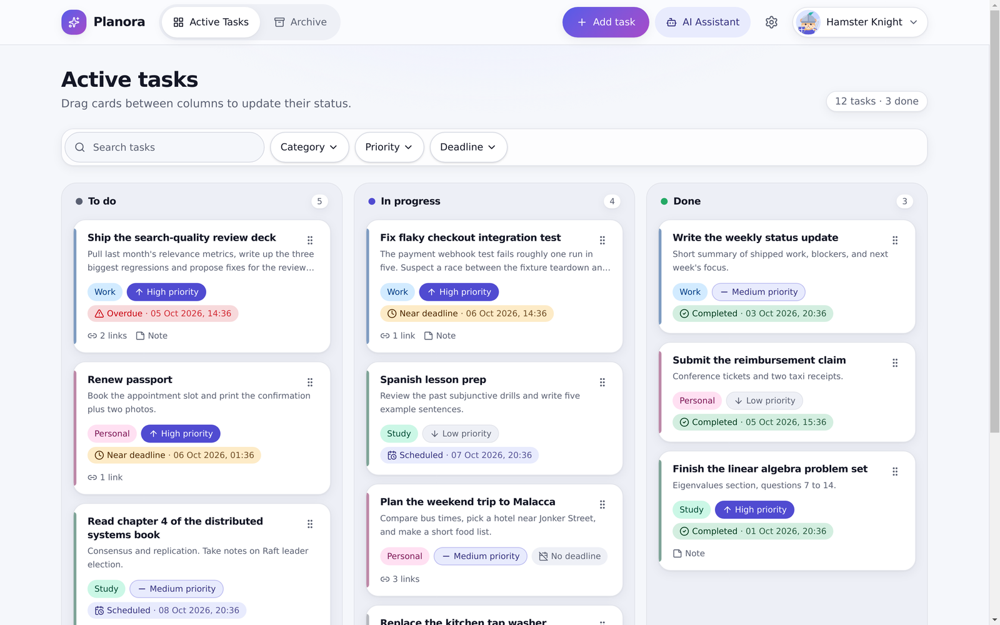
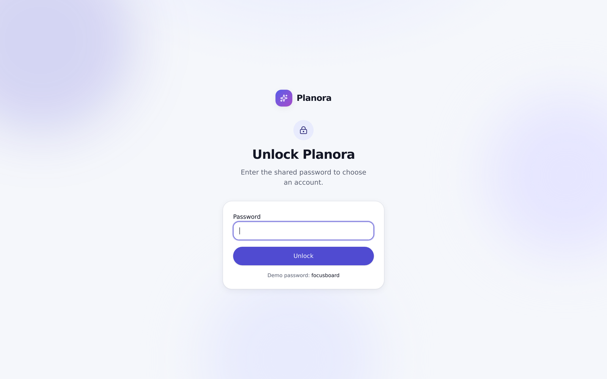
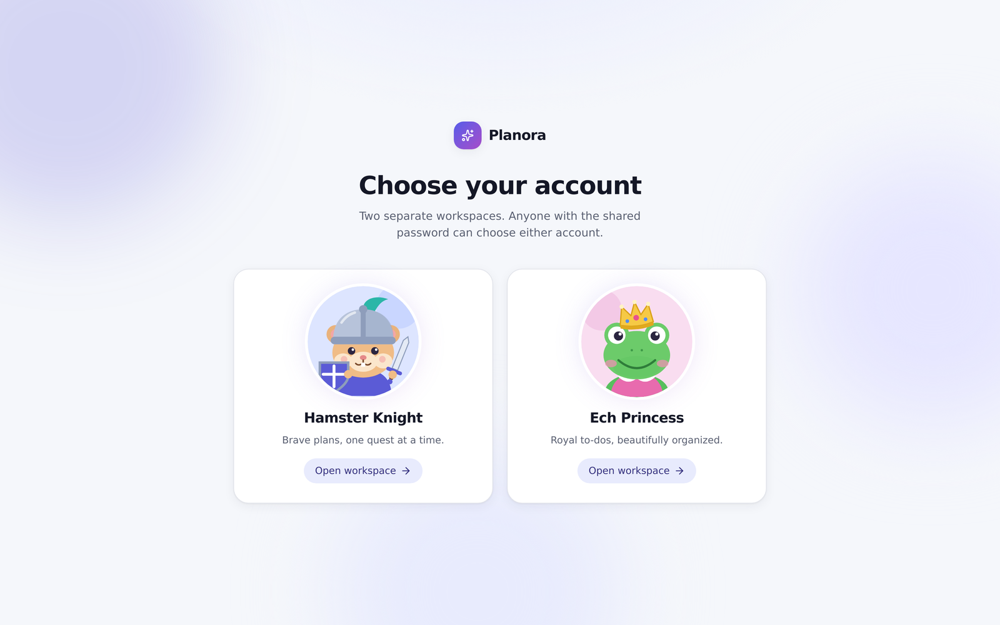
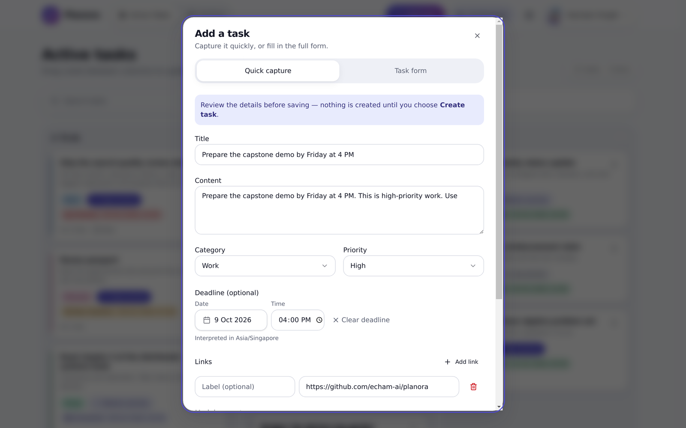
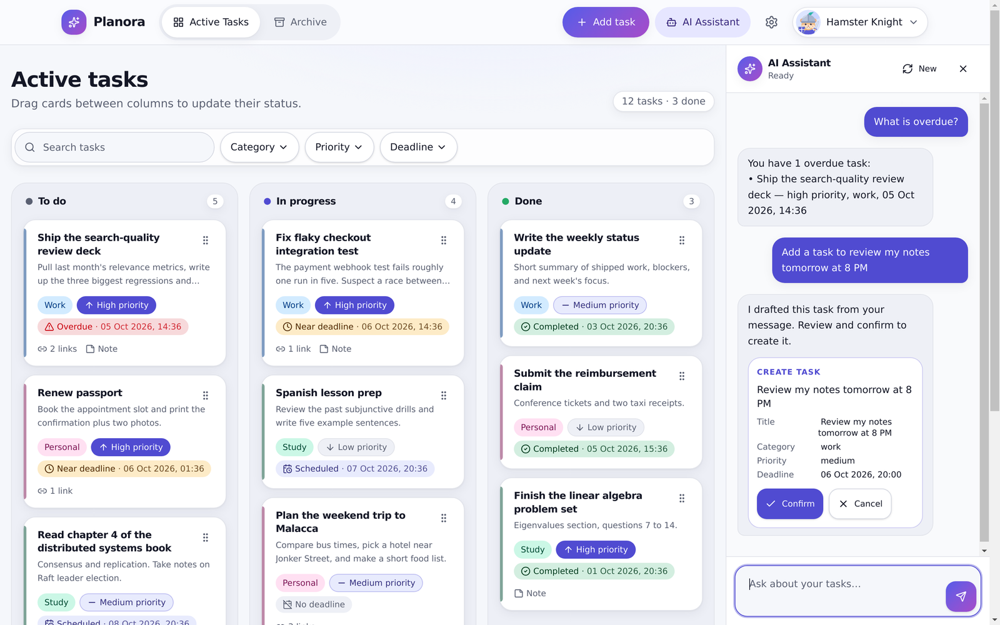
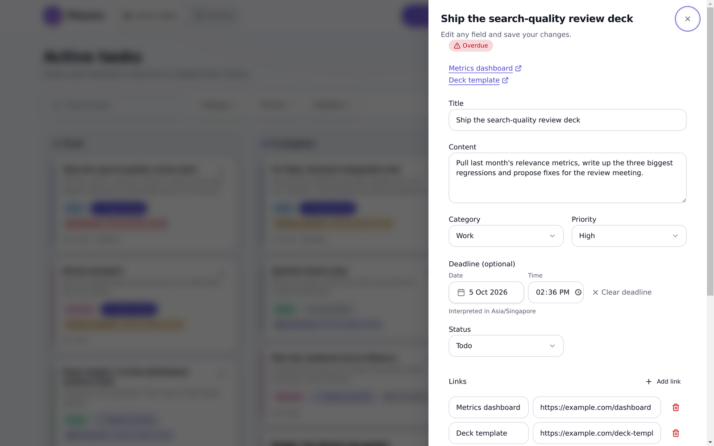
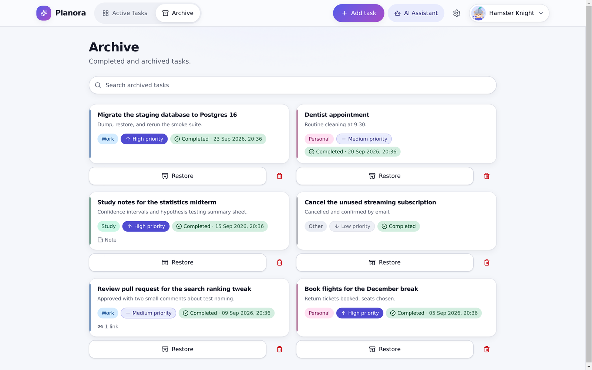
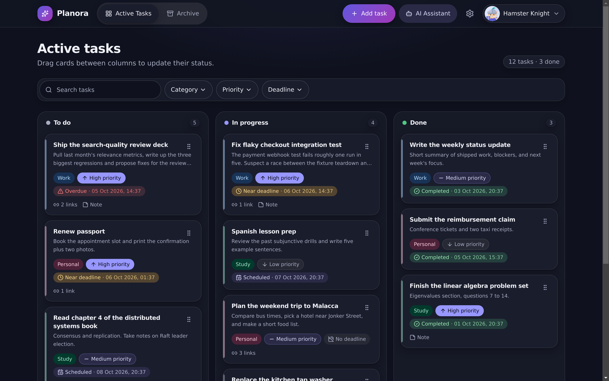
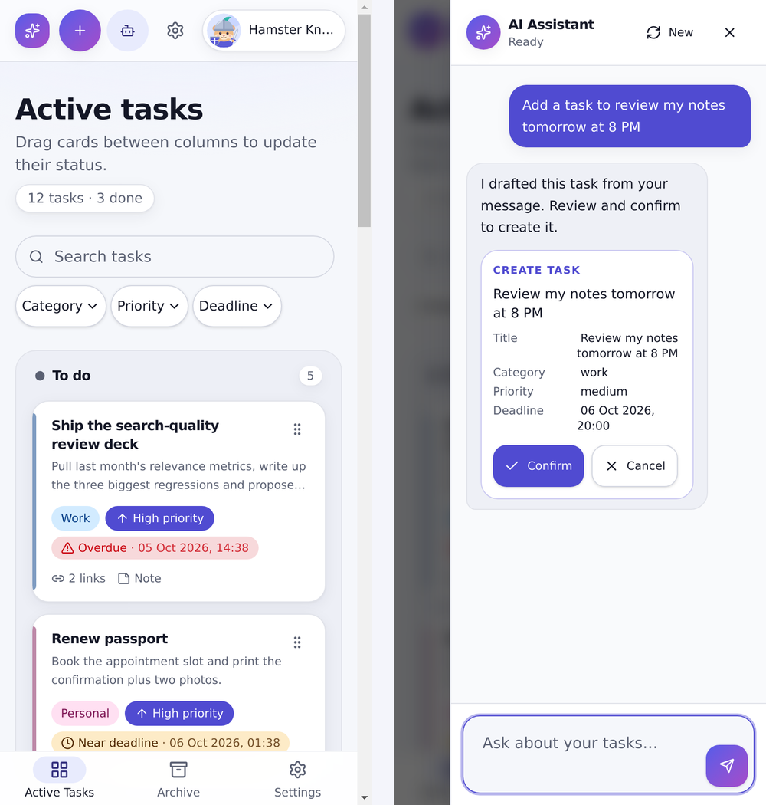
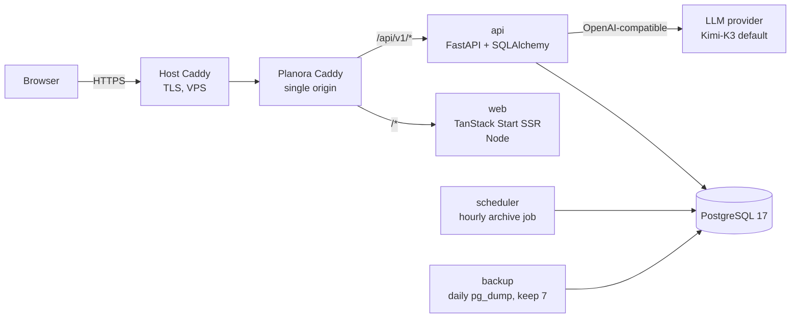

# Planora

Planora is a private AI task manager for two people who share one small workspace. You can type a task the way you'd say it, and the AI fills in the fields for you to check. You can also ask a chat assistant to find, create, move or reschedule tasks, and **nothing is saved until you confirm it**.

**Live:** https://planora.ai-tracker.cloud (protected by a shared site password; the [demo walkthrough](#demo) shows what's behind it)



## Problem

Personal task apps usually force a choice:

- **A plain to-do list** is fast to fill but gives no structure. Deadlines, priority and notes are all up to you, and overdue items quietly pile up.
- **A full project tool** (Jira, Asana) gives structure, but every task becomes a form to fill in.
- **AI assistants that "manage your tasks"** often act on their own. A misread sentence can quietly move, edit or delete the wrong thing.

Planora is built for a household of two (the profiles are **Hamster Knight** and **Ech Princess**). It aims to:

1. **Capture fast.** Write "pay the electricity bill by Friday 6pm, high priority" and get a pre-filled form to review.
2. **Make deadlines obvious.** Tasks due within 24 hours show amber, overdue tasks show red, and each colour comes with an icon and text so colour is never the only signal.
3. **Let the AI help but never decide.** Every write the assistant proposes appears as a card you confirm or reject.
4. **Keep finished work findable.** Done tasks are archived automatically after 7 days, and you can search and restore them.
5. **Run privately on a single VPS** that you control.

## Features

- **Kanban board.** Three columns: Todo, In Progress and Done. Cards can be dragged within a column and between columns. You can search, and filter by category, priority and deadline.
- **Task details.** Title, category, priority, deadline (shown in each profile's timezone), links and a Markdown note. The Markdown is sanitized before display.
- **AI quick capture.** Free text is parsed into fields (title, category, priority, deadline, links) for you to review before saving.
- **AI chat assistant.** Ask it to find, create, edit, move or schedule tasks, or to search the archive. Writes come back as proposals that need your confirmation, and in-flight AI requests can be cancelled.
- **Archive.** Done tasks are moved to the archive every hour once they have been done for 7 days. The archive supports title search, restore and permanent delete. Permanent delete asks you to confirm against the task title.
- **Two profiles behind one site password.** Each profile has its own tasks, archive, chat, timezone and model setting.
- **Works on desktop and mobile**, with light and dark themes.

## Demo

The screenshots below were taken from a local run in mock mode (`VITE_API_MODE=mock`), which ships with sample data. The interface is the same as in production. Mock mode uses a rule-based stand-in for the LLM, so the AI results show the flow rather than the real model's quality.

**1. Unlock with the shared site password, then choose a profile.**

| Unlock | Account chooser |
| --- | --- |
|  |  |

**2. The board.** There are three columns, plus search and filters. Deadline badges use colour, an icon and text together: red *Overdue*, amber *Near deadline* (within 24 hours), *Scheduled* and *Completed*.


**3. Quick capture.** A free-text sentence becomes a pre-filled form: title, category, priority, a deadline in the profile's timezone, and links. Nothing is created until you click *Create task*.



**4. The AI assistant proposes and you confirm.** Read-only questions such as "What is overdue?" get a direct answer. Any write, here "Add a task to review my notes tomorrow at 8 PM", comes back as a proposal card with exact fields and *Confirm* / *Cancel* buttons.



**5. Task details and the archive.** You can edit every field, open the task's links and change its status. Done tasks move to a searchable archive after 7 days, where you can restore them or delete them permanently.

| Task detail | Archive |
| --- | --- |
|  |  |

**6. Dark theme and mobile.** On phones, a bottom tab bar replaces the top navigation, and the chat opens as a full-height sheet.

| Dark theme | Mobile (board and chat) |
| --- | --- |
|  |  |

**Try it without a backend:** run `cd apps/web && bun install && bun run dev`. Mock mode is the default, and the demo password is shown on the unlock page.

## Architecture



- **Single origin.** Caddy routes `/api/v1/*` to the API and everything else to the web tier. There is no CORS, the cookie is first-party, and CSRF protection is an exact `Origin` check.
- **Browser-only data access.** The SSR server renders the app shell and never fetches app data or forwards cookies. All data calls go through one `ApiClient` interface (`apps/web/src/services/api`). It has two implementations: `http`, used in production, and `mock`, used for the demo and tests.
- **The API is the only authority on business rules.** The AI layer uses read tools that return metadata only, plus *proposal* tools. Proposals are applied only when the user confirms them, through normal API writes.
- **Database.** SQLite in development and PostgreSQL in production, with the same Alembic migration history for both. CI runs the integration suite against both databases.
- **Containers.** Six Compose services: `caddy`, `web`, `api`, `scheduler`, `db` and `backup`. Only Caddy publishes a port, and the database sits on an internal network.

### Tech stack

| Layer | Technology | Role |
| --- | --- | --- |
| Frontend | TanStack Start (React 19, Vite, Nitro), TypeScript, TanStack Router + Query, Tailwind v4 + shadcn/ui, dnd-kit, zod, react-hook-form, marked + DOMPurify | SSR shell and app UI. Uses zod for immediate form feedback only; the API does the real validation. |
| Backend | Python 3.12, FastAPI, SQLAlchemy 2, Alembic, httpx | REST API under `/api/v1`, auth gate, CSRF, rate limit, LLM integration, archive job |
| Database | SQLite (dev), PostgreSQL 17 (prod) | Persistence, scoped per profile |
| AI | Kimi-K3 via any OpenAI-compatible endpoint | Quick-capture parsing and the tool-calling chat |
| Packaging | `bun` (web), `uv` (API) | Lockfile-pinned installs |
| Containers | Docker Compose, Caddy 2 | Runs the full stack locally and in production |
| CI | GitHub Actions | Lint, typecheck, unit tests, integration tests (SQLite and PostgreSQL), E2E (mock, HTTP and Compose) |
| Tests | Vitest, Playwright, pytest, ruff, ESLint | Coverage gate of at least 80% on both tiers |

Key decisions and their trade-offs are recorded in [`docs/adr/`](docs/adr). See [the decisions below](#decisions-and-trade-offs).

## API contract

- **Spec file:** [`apps/api/openapi.json`](apps/api/openapi.json) (OpenAPI 3.1) covers every endpoint, request/response schema and error envelope under `/api/v1`. You can render it with any OpenAPI viewer, such as editor.swagger.io.
- **How it's kept in sync:**
  - The contract is exported from the FastAPI code with `uv run python -m planora_api.openapi`.
  - The frontend's wire types are generated from it with `bun run gen:api-types`, which writes `src/shared/api/schema.gen.ts`.
  - CI re-exports both files and fails on any difference, so the backend, the contract and the frontend types can't drift apart.
- **How the API was designed:** contract first, from the frontend. The mock `ApiClient` was built before the backend and defined what the UI needs. The API was then implemented to that interface, and swapping in the HTTP client required no page changes (spec acceptance criterion 16; `AGENTS.md` binding rule 3).
- **Wire format:** wire names are `snake_case` and TypeScript names are `camelCase`. The only place that converts between them is `apps/web/src/services/api/http/mappers.ts`, which has a 100% coverage gate.

## Quickstart

**Requirements:**

- Docker with Compose 2.24 or later, for the full stack
- or [`uv`](https://docs.astral.sh/uv/) and [`bun`](https://bun.sh) 1.4, for local development
- Python 3.12, which `uv` installs automatically

### Option 1: Full stack with Docker Compose

```bash
git clone https://github.com/echam-ai/planora.git && cd planora
mkdir -p .tmp && cp deploy/.env.example .tmp/planora.env     # then fill every empty value (see Configuration)
C="docker compose --env-file .tmp/planora.env -p planora-local -f deploy/compose.yml"
$C build
$C up -d --wait db
$C run --rm --no-deps api alembic upgrade head
$C up -d
open http://127.0.0.1:18080                    # unlock with APP_PASSWORD
```

### Option 2: Local development on macOS, without Docker

```bash
cp apps/api/.env.example apps/api/.env       # set LLM_API_KEY, APP_PASSWORD, SESSION_SECRET
scripts/run-local.sh                          # API + web (HTTP mode) + archive job → http://localhost:5173
```

See [`docs/ops/run-local.md`](docs/ops/run-local.md) for details, including how to stop the services and free their ports.

### Option 3: Frontend only, with mock data

```bash
cd apps/web && bun install && bun run dev     # VITE_API_MODE defaults to mock
```

### Configuration

| Variable | Required | Meaning |
| --- | --- | --- |
| `APP_PASSWORD` | yes, at least 12 characters | The one shared site password |
| `SESSION_SECRET` | yes, at least 32 characters | Signs the `planora_access` cookie. Rotating it signs every browser out. |
| `APP_ORIGIN` | yes | The exact origin the browser shows, such as `https://planora.example.com`. Used for the CSRF check and the `Secure` cookie flag. |
| `LLM_API_KEY` | yes | Key for the LLM endpoint. `placeholder` runs everything except the AI features. |
| `LLM_BASE_URL`, `LLM_MODEL`, `LLM_ALLOWED_MODELS` | no | Defaults are Moonshot and `kimi-k3`. Any OpenAI-compatible endpoint works. |
| `DATABASE_URL` | no (dev) / yes (Compose) | SQLite file by default; `postgresql+psycopg://…` in production |
| `POSTGRES_*`, `PROXY_SUBNET`, `CADDY_IP`, `CADDY_*` | Compose only | See [`deploy/.env.example`](deploy/.env.example) |
| `DEFAULT_TIMEZONE` | Compose | IANA timezone used for new profiles |

The API refuses to start if a required value is missing or too short. The error names the offending variable but never prints its value.

## Testing

| Suite | Scope | Command | Needs |
| --- | --- | --- | --- |
| Web unit and component | 55 files, about 530 Vitest tests. Covers the board, forms, deadline logic, mappers, `ApiClient` and routes. Each file needs at least 80% coverage. | `cd apps/web && bun run verify` (tests with coverage, lint, typecheck, build) | `bun install` |
| Web E2E (mock) | 22 Playwright specs on desktop and Pixel 5 | `cd apps/web && bun run e2e` | `bunx playwright install chromium` |
| API unit | 31 files in `apps/api/tests/unit`. Covers domain rules, token and CSRF, redaction, config. | `cd apps/api && uv run pytest tests/unit` | `uv sync` |
| API integration | 49 files in `apps/api/tests/integration`. Real HTTP through the app against a migrated database: CRUD, archive, chat proposals, races, auth, migrations, OpenAPI contract. | `cd apps/api && uv run pytest tests/integration` (SQLite) or add `--db-backend=postgresql` with `PLANORA_TEST_POSTGRES_URL` set | PostgreSQL only for the second variant |
| Full API gate | All API tests with the 80% coverage gate, plus lint | `uv run pytest --cov --cov-fail-under=80 && uv run ruff check .` | `uv sync` |
| HTTP E2E | 5 Playwright smoke tests. Starts its own uvicorn API and web server on a fresh SQLite database. | `cd apps/web && bun run e2e:http` | `uv sync` in `apps/api` |
| Compose E2E | Browser checks against the six-service stack, plus TLS and backup/restore smoke tests | `bun run e2e:compose`; see [`compose-stack.md`](docs/ops/compose-stack.md) | Docker |

Unit and integration tests are kept in separate directories. All of these suites run in CI.

## Deployment

- **Where it runs:** Planora runs at **https://planora.ai-tracker.cloud** on a Hostinger KVM 2 VPS (Ubuntu). The VPS also hosts other apps, so its host Caddy owns ports 80/443 and terminates TLS with Let's Encrypt. It forwards `planora.ai-tracker.cloud` to Planora's own Caddy, which listens on loopback port 3002.
- **Shared-host mode:** this is [`deploy/compose.behind-proxy.yml`](deploy/compose.behind-proxy.yml), documented in [`docs/ops/deploy-shared-host.md`](docs/ops/deploy-shared-host.md). It keeps the real client IP for the unlock rate limiter.
- **Dedicated VPS:** Planora's Caddy can get certificates itself; see [`docs/ops/deploy.md`](docs/ops/deploy.md).
- **Secrets:** they live only in `/srv/planora/runtime.env` (mode 0600), are generated on the server, and are never committed.
- **How deploys happen:** deploys are manual for now. The latest commit is pushed to the VPS, then built and migrated there, then the services are started. There is no automatic deploy job yet; see [Limitations](#limitations).
- **Proof of deployment:**
  - [`docs/deployment/`](docs/deployment) holds external checks made from outside the VPS: HTTP→HTTPS redirect, health endpoints, a 401 without the cookie, a 403 for a foreign `Origin`, and the TLS certificate. They're generated by [`scripts/deploy-proof.sh`](scripts/deploy-proof.sh).
- **Operations:**
  - Backups run daily with `pg_dump` and keep the latest 7, with a restore drill; see [`backup-restore.md`](docs/ops/backup-restore.md).
  - Password rotation is covered in [`password-reset.md`](docs/ops/password-reset.md).
  - [`scripts/ops-diagnose.sh`](scripts/ops-diagnose.sh) produces a health snapshot; the latest is [`security/ops-diagnosis.md`](security/ops-diagnosis.md).

## CI/CD

[`.github/workflows/ci.yml`](.github/workflows/ci.yml) runs on every push. It has five independent jobs, so a failure in one still reports the others:

| Job | Steps |
| --- | --- |
| **Web** | Install from the frozen lockfile, ESLint, typecheck, Vitest with coverage, build, check that generated routes and API types are up to date, Playwright E2E |
| **API** | `uv sync --frozen`, ruff, pytest with the 80% coverage gate, check that `openapi.json` is up to date |
| **API integration (PostgreSQL 17)** | Migrate a PostgreSQL service container twice (idempotency), then run the shared integration suite against it |
| **E2E (HTTP)** | Real API and web server, Playwright smoke tests |
| **Compose stack (Docker)** | Build the six-service stack, run browser E2E against it, a TLS fixture smoke test, and a backup/restore smoke test |

Any failed job marks the commit red. Merges to `main` happen only after the review pipeline and CI pass ([`docs/PROCESS.md`](docs/PROCESS.md)).

## AI-assisted development

Coding agents built Planora through a documented, role-based pipeline. A human owns every decision, reviews every change and makes every push.

- **Context files.**
  - [`AGENTS.md`](AGENTS.md) sets the stack and 11 binding rules, such as "the API is the only authority", "never hand-edit generated files" and "tests first, 80% coverage".
  - [`CLAUDE.md`](CLAUDE.md) holds the Claude Code specifics.
  - [`docs/specs/planora-v1-product-spec.md`](docs/specs/planora-v1-product-spec.md) is the product spec and the source of acceptance criteria.
  - [`docs/adr/`](docs/adr) records architecture decisions.
- **Task delegation.**
  - Work is tracked as GitHub issues ([backlog](docs/tasks.md)).
  - An orchestrator session dispatches six role agents from [`.agents/`](.agents): product manager, designer, web engineer, API engineer, tester and on-call. Claude Code reads them through the `.claude/agents` symlink; Codex has its own role files in [`.codex/agents/`](.codex/agents).
  - Each issue runs in its own git worktree.
  - Slash commands encode the pipeline: `/next` picks the next ready issue, `/issue N` runs one issue end to end, `/verify` runs the checks for the current stage, and `/ship N` merges, pushes and cleans up.
- **Review and verification.**
  - The PM grooms each issue with acceptance criteria and test scenarios, and an engineer implements it test-first.
  - An **independent tester** (a different agent from the engineer) runs the full gates on the final state. Browser evidence follows a fixed order: Playwright specs first, then ARIA snapshots, then screenshots.
  - The PM accepts the result, then the orchestrator merges.
  - Criteria that need a human are labeled `[HUMAN]` and stay open until a person checks them.
  - See [`docs/PROCESS.md`](docs/PROCESS.md) for the full process.
- **Guardrails.**
  - [`.claude/settings.json`](.claude/settings.json) and [`.codex/rules/planora.rules`](.codex/rules/planora.rules) mechanically deny force-push, `git reset --hard`, `git stash`, npm/pip, PR creation and edits to generated files.
  - `git push` and `git merge` require approval.
- **What humans did:**
  - chose the stack (ADR 0001 deliberately picked Option B over the recommended Option A)
  - approved the scope
  - did the `[HUMAN]` checks, such as the external HTTPS/TLS checks
  - ran the deployment
  - reviewed security findings

## Security

Security artifacts are in [`security/`](security):

- [deterministic scan findings](security/scan-findings.md): Semgrep, Bandit, zizmor, detect-secrets, pip-audit and the npm advisory database
- a [PR audit](security/pr-audit-124.md) of the site-password change
- [agent and extension security notes](security/agent-security-notes.md)
- an [operational diagnosis](security/ops-diagnosis.md)
- the [AI tool and data policy](security/ai-tool-data-policy.md)

Built-in protections:

- a default-deny auth gate
- an HMAC-signed `HttpOnly` cookie
- exact-`Origin` CSRF checks
- a per-IP unlock rate limit
- redacted logs: no secrets, prompts or task content
- confirm-only AI writes

## Project structure

```text
apps/
  web/                    Frontend (TanStack Start)
    src/routes/           Pages: login, chooser, tasks board, archive, settings
    src/features/         tasks, chat, auth, settings components and hooks
    src/services/api/     ApiClient interface + http/ and mock/ implementations
    e2e/  e2e-http/       Playwright suites (mock mode, real HTTP)
  api/                    Backend (FastAPI)
    src/planora_api/
      api/v1/             Routers: auth, tasks, archive, chat, ai, settings, profiles
      domain/             Pure business rules (no I/O): ordering, deadlines, archive policy
      db/                 SQLAlchemy models + repositories
      ai/                 LLM client, prompts, chat tools, proposals, redaction
      security/           Access gate, token, CSRF, rate limit
      jobs/               Hourly archive scheduler
    alembic/              Migrations (shared by SQLite and PostgreSQL)
    tests/unit/  tests/integration/
    openapi.json          Exported API contract
deploy/                   docker-compose files, Caddyfiles, backup worker
docs/                     Spec, ADRs, process, ops runbooks, deployment proof, images
security/                 Scan reports, PR audit, policies, ops diagnosis
scripts/                  run-local.sh, deploy-proof.sh, ops-diagnose.sh
.agents/ .claude/ .codex/ Agent roles, commands, permissions
```

The course rubric names several paths that live elsewhere in this repo:

| Rubric path | Location in this repo |
| --- | --- |
| `frontend/` | `apps/web/` |
| `backend/` | `apps/api/` |
| `product-spec.md` | `docs/specs/planora-v1-product-spec.md` |
| `openapi.yaml` | `apps/api/openapi.json` |
| `docker-compose.yml` | `deploy/compose.yml` |
| `ops/` | `docs/ops/` |

## Decisions and trade-offs

- **FastAPI next to TanStack Start, instead of an all-TypeScript monolith.**
  - *Why:* Python's LLM tooling and Alembic are more mature, and the API can be tested and replaced on its own.
  - *Cost:* two toolchains, and the frontend types have to be generated from the contract. I accepted this and made CI enforce the generation (ADR 0001).
- **Confirm-only AI.**
  - *Why:* the model can propose writes but can never perform them, so a prompt injection or a misread request costs one rejected card.
  - *Cost:* an extra click for every AI change.
- **Two fixed profiles behind one shared password, instead of user accounts.**
  - *Why:* it fits a household of two and needs no account management.
  - *Cost:* profile choice is not identity protection; anyone with the password can open either profile. This is stated in the UI and the spec.
- **Stateless signed cookie.**
  - *Why:* there is no session table to manage.
  - *Cost:* there is no per-session revocation; rotating `SESSION_SECRET` revokes every cookie at once.
- **In-memory rate limit on a single API process.**
  - *Why:* simple, and enough for one VPS.
  - *Cost:* it doesn't scale across workers; see the [PR audit](security/pr-audit-124.md) F1.
- **Local merges with an agent review pipeline, instead of GitHub PRs.**
  - *Why:* review lives in issue handoffs and CI.
  - *Cost:* there are no PR pages to browse, so security audits are run against merge commits instead.

## Limitations

- **No continuous deployment.** CI tests every push, but deploying is a manual step.
- **Single shared password.** There are no per-user accounts or 2FA, and brute-force protection is per IP only.
- **The AI provider sees task titles and chat text.** By default this is Moonshot; see the [AI policy](security/ai-tool-data-policy.md). The AI features are off without a real key.
- **No metrics or tracing dashboard.** Operations rely on structured logs and the diagnosis script.
- **Open hardening items:** CI actions aren't pinned to commit SHAs, and dompurify needs a bump to 3.4.16 ([scan findings](security/scan-findings.md)).

## Future work

1. Add a GitHub Actions deploy job that runs after CI passes on `main`: SSH to the VPS, build, migrate, then `up --wait`, and roll back if the health check fails.
2. Add a site-wide failure budget for unlock attempts and IPv6 /64 bucketing (PR audit F1).
3. Pin CI actions to commit SHAs and add a scan job that runs `security/run-scans.sh` on every push.
4. Add an evaluation set for quick-capture parsing, covering dates, priorities and links, and track its accuracy per model.

## Self-evaluation (AI Dev Tools Zoomcamp rubric)

| # | Criterion | Claim | Evidence |
| --- | --- | --- | --- |
| 1 | Problem description | 2 | [Problem](#problem), [Features](#features) |
| 2 | AI-assisted workflow | 2 | [AI-assisted development](#ai-assisted-development), `AGENTS.md`, `docs/PROCESS.md`, `.agents/` |
| 3 | Technologies and architecture | 2 | [Architecture](#architecture), [Tech stack](#tech-stack), `docs/adr/` |
| 4 | Frontend | 3 | `services/api/ApiClient.ts`, 55 Vitest files with an 80% gate, [Testing](#testing) |
| 5 | API contract | 2 | [API contract](#api-contract), `apps/api/openapi.json`, CI diff checks |
| 6 | Backend | 3 | `apps/api/src`, 80 pytest files, `test_openapi_contract.py` |
| 7 | Database | 2 | SQLite and PostgreSQL, Alembic, PostgreSQL CI job, `docs/ops/database-verification.md` |
| 8 | Containerization | 2 | `deploy/compose.yml`, [Quickstart](#option-1-full-stack-with-docker-compose) |
| 9 | Integration testing | 2 | `apps/api/tests/integration/`, `e2e-http/`, Compose E2E |
| 10 | Deployment | 2 | Live URL, [`docs/deployment/`](docs/deployment) (external checks) |
| 11 | CI/CD | 1 | CI only, no deploy job yet |
| 12 | Agent extension pack | 1 | Instructions, commands, subagents and permissions. There is no MCP server or hook yet. |
| 13 | Security/audit/DevOps | 2 | [`security/`](security) |
| 14 | Reproducibility | 2 | [Quickstart](#quickstart), [Testing](#testing), [Deployment](#deployment) |

## More documentation

- [Product spec](docs/specs/planora-v1-product-spec.md)
- [Development process](docs/PROCESS.md)
- [Backlog](docs/tasks.md)
- [ADRs](docs/adr)
- [Ops runbooks](docs/ops)
- [API tier README](apps/api/README.md)
